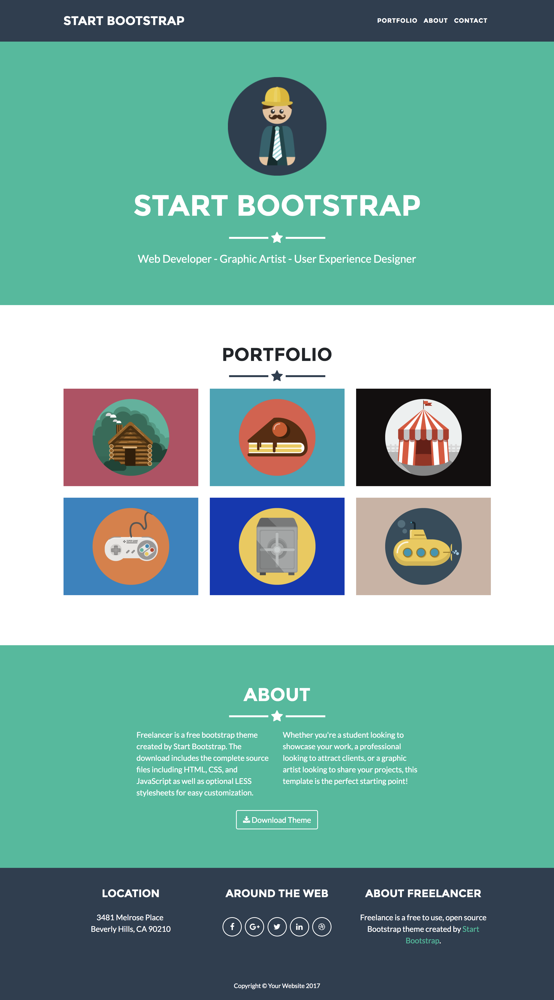

# Portafolio de cliente

* **Track:** _Common Core_
* **Curso:** _Creando tu primer sitio web interactivo_
* **Unidad:** _Maquetado web con HTML & CSS_

***

Tienes un cliente nuevo! Nos acaba de contactar porque necesita una página web
para el lunes al final del día. El cliente ha estado trabajando con un diseñador
gráfico, quien ha creado un mockup de cómo debería verse la página.

El cliente está contento con el diseño y ya lo han aprobado. Pero, ...siempre
hay peros..., nos dicen que, a la hora de hacer la plantilla, se les olvidó
tener en cuenta una sección de _recetas_. Así que tenemos que hacer una
propuesta de cómo podemos incluir esta sección en el layout. Sumado a esto, el
cliente tiene una lista de cambios que le gustaría ir incluyendo poco a poco (el
backlog del proyecto), y quiere saber si podrías incluir alguno de estos cambios
para el release del lunes.

El diseño propuesto:



## Objetivos del reto

El reto consiste en:

* Crear propuesta de cómo añadir la nueva sección de recetas
* Sustentar tu propuesta y recolectar feedback
* Elegir tareas del backlog que creas que puedas completar durante el reto
* Crear plan de acción
* Documentar propuesta y plan de acción en el `README.md`
* Implementar la página usando `HTML` y `CSS`
* Desplegar la página en GitHub pages
* Compartir tu experiencia de aprendizaje con el resto de la clase en una demo
  al final

## Agenda

### Día 1

1. **Kick-off** (15min)
2. **Sketching**: crear propuesta de cómo añadir sección de recetas (20min)
3. **Pitching**: Sustentar tu propuesta y recolectar feedback (20min)
4. Crear **plan de acción** opcionalmente incluyendo tareas del backlog si
   consideras que te puede alcanzar el tiempo.
5. Iniciar **implementación**
6. Al finalizar la sesión debes haber hecho `commit` y `push` de tu `README.md`
   así como de tu código fuente en proceso.

### Día 2

1. **Daily** (30min)
2. **Implementación** (3h)
3. **Despliegue** en GitHub Pages
4. **Pull request**
5. **Demos** (1h)

## Flujo de trabajo

Para completar este reto, hemos creado este repositorio boilerplate (plantilla
inicial) con todos los recursos que necesitas. Esto incluye imágenes y
estructura de carpetas y archivos donde colocarás tu código.

1. Debes realizar un [**fork**](https://gist.github.com/ivandevp/1de47ae69a5e139a6622d78c882e1f74)
   de este repositorio.

2. Luego deberás **clonar** tu fork en tu máquina. Recuerda que el comando a usar
   es `git clone` y su estructura normalmente se ve así:

   ```bash
   git clone https://github.com/<nombre-de-usuario>/client-portfolio.git
   ```

## Consideraciones

* Encontrarás un archivo base `index.html` en el cual deberás escribir la
  estructura de tu proyecto y enlazar tus archivos de estilos (CSS).

* En la carpeta `css` tendrás un archivo base `main.css` donde agregarás los
  estilos necesarios para tu proyecto.

* Dentro de la carpeta `assets` se encuentra la carpeta `images` donde
  encontrarás todas las imágenes necesarias para completar tu proyecto.

* Deberás **actualizar el archivo `README.md`** explicando tu propuesta y plan
  de acción.

* Esta web utiliza 2 tipografías: `Montserrat` y `Lato`.

* La paleta de colores puedes obtenerla inspeccionado el sitio original, pero
  para ganar tiempo, puedes usar los siguientes: `#2c3e50`, `#18bc9c`,
  `#212529`.

* Los íconos de redes sociales puedes obtenerlos de [Font Awesome](http://fontawesome.io/).

* El subrayado que incluye la estrella en las diversas secciones del sitio, en
  la web original se hace con un ícono y pseudoelementos (`:after`, `:before`),
  es un reto entretenido, sin embargo, no trates de enfocarte en esa parte desde
  un inicio ya que no es el objetivo principal del reto :)

* Para este reto, encontrarás ciertas cosas que probablemente aun no has visto
  en clase. No te preocupes, estamos seguros que lo afrontarás con éxito.
  Recomendamos seguir los siguientes pasos cuando te sientas atracada:

  1. Busca en Google
  2. Busca en la documentación del lenguage, herramienta, librería, ...
  3. Pregunta a tus compañeras
  4. Pregunta en el canal de slack de la clase
  5. Pregunta a tus TAs y/o instructorxs
